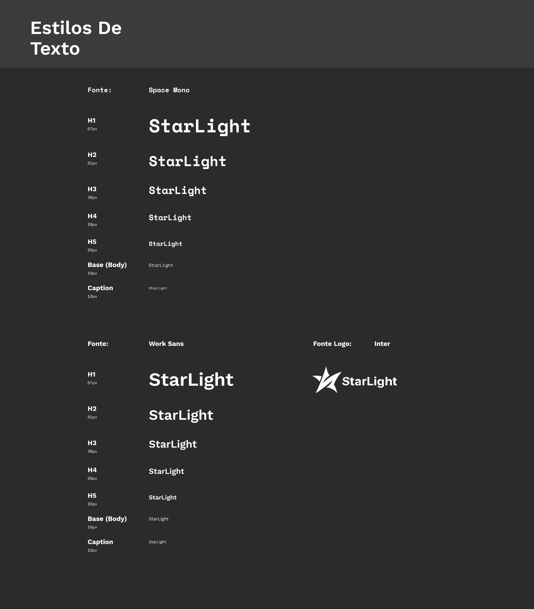
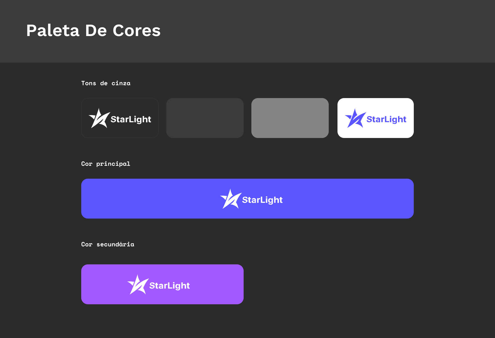
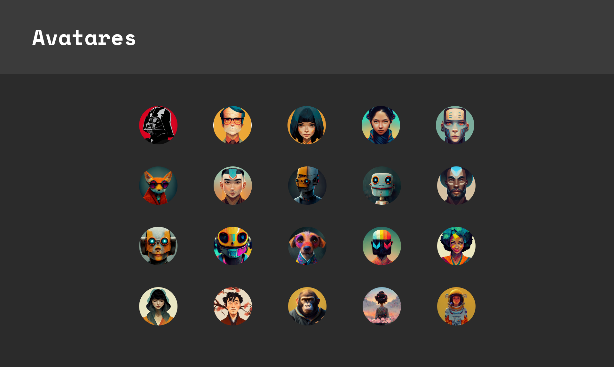

# StarLight
## Um projeto de site de venda de NFT

-------

### softwares utilizados:

- Figma
- VS code
- Adobe Illustrator

## **Tipografia**

## **Botões**

## **Paleta de Cores**

## **Avatares**

-------
## Créditos pelo codigo JavaScript:

Created by Sergiu Șandor (micku7zu) on 1/27/2017.
Original idea: https://github.com/gijsroge/tilt.js
MIT License.
Version 1.7.3
